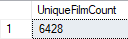
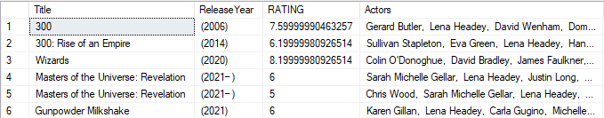
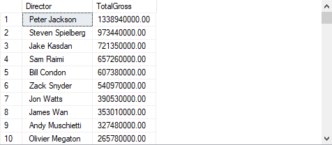
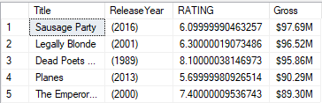
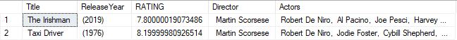

# 🎥 Movies Analysis
This project is to analyze a Movies Dataset about ratings and movie information

* Tools: Microsoft SQL Server Management Studio
* Dataset: `movies.csv`

1. Create a data model (conceptual data model is mandatory, logical, and physical data model
is a plus).

| **Feature** | **Description**                                        | **Relationships**                                                                                     |
| ----------- | ------------------------------------------------------ | ----------------------------------------------------------------------------------------------------- |
| `MOVIES`    | Movie title                                            | **Primary identifier** of a movie. Related to year, genre, stars, rating, runtime, etc.               |
| `YEAR`      | Year of release (can be a range or "2021–")            | **1:1** with a movie (each movie has one certain year of release/range)                                   |
| `GENRE`     | Comma-separated genres                                 | **Many-to-Many** with movies (a movie can have multiple genres; a genre can apply to multiple movies) |
| `RATING`    | IMDb rating                                            | **1:1** with a movie                                                                                  |
| `ONE-LINE`  | Short synopsis                                         | **1:1** with a movie                                                                                  |
| `STARS`     | Includes director(s) and actor(s) in one string        | **Many-to-Many** with movies through roles (director, actor). Must be **split**.                      |
| `VOTES`     | Number of user ratings                                 | **1:1** with a movie, part of the `Rating` entity                                                     |
| `RunTime`   | Duration in minutes                                    | **1:1** with a movie                                                                                  |
| `Gross`     | Box office gross                                       | **1:1** with a movie (may be missing (null) for many entries)                                             |

2. Create a database based on the data model that has been created

    SQL Code: `2. Database Creation.sql`

4. Create an ETL script to import the movies.csv dataset into the created database

    SQL Code: `3. ETL Script.sql`

5. Create a query to display:

    a. Number of unique film titles

      

    b. Film Title, Year of Release, and Rating of the film starring Lena Headey Sort By Year of Release.
      

    c. The name of the director and total gross of the films that have been directed.
      

    d. Film Title, Year of Release, and Rating of 5 films that have comedy genre with the largest gross
      

    e. Film Title, Year of Release and Rating of the film directed by Martin Scorsese and starring Robert De Niro
    

   SQL Code: `24. Stored Procedure Query.sql`
